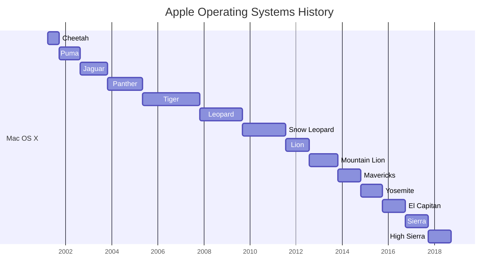
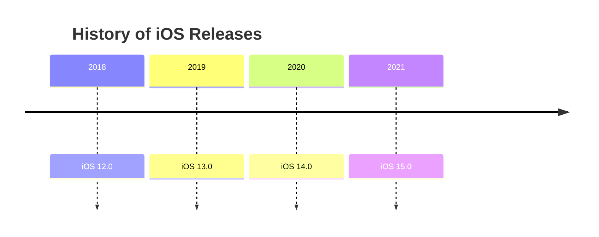

# version-history

Okay, I can reformat the timeline for you. Here is the code block you can use in a markdown doc using mermaid:

| Release Year | MacOS Version | iOS Version | Xcode Version | Swift Version |
|--------------|---------------|-------------|---------------|--------------|
| - | - | [ Release Notes](https://developer.apple.com/documentation/ios-ipados-release-notes) | [ Release Notes](https://developer.apple.com/documentation/xcode-release-notes), [Wiki](https://en.wikipedia.org/wiki/Xcode) | - |
| 2016         | [Sierra (version 10.12)](https://en.wikipedia.org/wiki/MacOS_Sierra)        | [iOS 10.0](https://en.wikipedia.org/wiki/IOS_10)        | [Xcode 8.0](https://en.wikipedia.org/wiki/Xcode#Xcode_8)        | [Swift 3.0](https://en.wikipedia.org/wiki/Swift_(programming_language)#Swift_3)        |
| 2017         | [High Sierra (version 10.13)](https://en.wikipedia.org/wiki/MacOS_High_Sierra)        | [iOS 11.0](https://en.wikipedia.org/wiki/IOS_11)        | [Xcode 9.0](https://en.wikipedia.org/wiki/Xcode#Xcode_9)        | [Swift 4.0](https://en.wikipedia.org/wiki/Swift_(programming_language)#Swift_4)        |
| 2018         | [Mojave (version 10.14)](https://en.wikipedia.org/wiki/MacOS_Mojave)        | [iOS 12.0](https://en.wikipedia.org/wiki/IOS_12)        | [Xcode 10.0](https://en.wikipedia.org/wiki/Xcode#Xcode_10)        | [Swift 4.2](https://en.wikipedia.org/wiki/Swift_(programming_language)#Swift_4.2)        |
| 2019         | [Catalina (version 10.15)](https://en.wikipedia.org/wiki/MacOS_Catalina)        | [iOS 13.0](https://en.wikipedia.org/wiki/IOS_13)        | [Xcode 11.0](https://en.wikipedia.org/wiki/Xcode#Xcode_11)        | [Swift 5.0](https://en.wikipedia.org/wiki/Swift_(programming_language)#Swift_5)        |
| 2020  | [Big Sur (version 11)](https://en.wikipedia.org/wiki/MacOS_Big_Sur) | [iOS 14.x](https://en.wikipedia.org/wiki/IOS_14)  | [Xcode 12.x](https://en.wikipedia.org/wiki/Xcode#Xcode_12)  | [Swift 5.3](https://en.wikipedia.org/wiki/Swift_(programming_language)#Swift_5.3) |
| 2021 | [Monterey (version 12)](https://en.wikipedia.org/wiki/MacOS_Monterey) | [iOS 15.x](https://en.wikipedia.org/wiki/IOS_15) | [Xcode 13.x](https://en.wikipedia.org/wiki/Xcode#Xcode_13) | [Swift 5.4](https://en.wikipedia.org/wiki/Swift_(programming_language)#Swift_5.4) |
| 2022 | [MacOS Ventura (version 13)](https://en.wikipedia.org/wiki/MacOS_Ventura) | [iOS 16.0](https://en.wikipedia.org/wiki/IOS_16) | [Xcode 14.0](https://en.wikipedia.org/wiki/Xcode#Xcode_14) | [Swift 5.6](https://www.swift.org/blog/swift-5.6-released/), [Swift 5.7](https://www.swift.org/blog/swift-5.7-released/) |

#### Short

Here is a table of MacOS, iOS and Xcode major version number and release year:

| Release Year | macOS Version | iOS/iPadOS Version | Xcode Version | Swift Version |
| --- | --- | --- | --- | --- |
| 2020 | macOS 11 Big Sur | iOS/iPadOS 14 | Xcode 12 | Swift 5.2, 5.3 |
| 2021 | macOS 12 Monterey | iOS/iPadOS 15 | Xcode 13 | Swift 5.4, 5.5 |
| 2022 | macOS 13 Ventura | iOS/iPadOS 16 | Xcode 14 | Swift 5.6, 5.7 |

Inhale deeply, drawing the air into your body. 

Exhale slowly, releasing any negative thoughts or emotions
